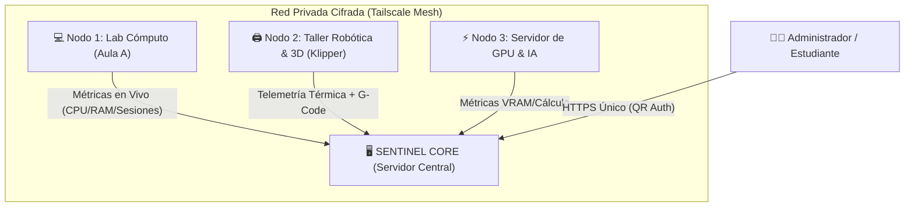

# 🛡️ SentinelOS (v2.0)
### *Sistema Operativo Cognitivo Distribuido para Laboratorios STEM, Centros de Cómputo e Investigación*

[](#-despliegue-con-docker)
[](#-tailscale-zero-config--qr)
[](#-motor-cognitivo-stem)
[](#-sentinel-mesh-monitoreo-multi-servidor)
[](https://opensource.org/licenses/MIT)

---

## 📌 ¿Qué es SentinelOS?

**SentinelOS** es una plataforma integral de código abierto diseñada para transformar servidores ordinarios en **centros cognitivos de telemetría, gestión y docencia STEM**. Permite controlar, supervisar y asistir técnicamente en tiempo real laboratorios escolares, makerspaces, nodos de computación y servidores de investigación.

Integra un **motor de lenguaje local purificado (SLM 1B / 3B)** acelerado por CPU AVX2, interfaz web aeroespacial en React (Cockpit), conexión distribuida por túneles cifrados y un sistema de plugins modulares.



---

## ✨ Características Principales

* 🐳 **Universal & Dockerizado:** Cero problemas de *"en mi máquina sí funciona"*. Se despliega con Docker Compose en cualquier distribución de Linux, macOS o Windows (WSL2).
* 🧠 **Motor Cognitivo STEM Local:** Asistente especializado en matemáticas, física, ingeniería y código. Funciona a más de **20 tokens/segundo** en CPUs Haswell i5 gracias a la optimización vectorial AVX2 nativa y cuantización Q4_K_M.
* 🌐 **Sentinel Mesh (Monitoreo de Flota):** Conecta decenas de servidores satélite a tu servidor principal. Monitorea en vivo uso de CPU, RAM, GPU (NVIDIA/Intel), temperaturas, sesiones activas y ejecuta comandos autorizados.
* 🔒 **Tailscale Zero-Config con QR:** Autenticación instantánea en la terminal escaneando un código QR desde el móvil. Genera un dominio HTTPS seguro (`https://labsentinel.ts.net`) sin abrir puertos en el router.
* 🧩 **Catálogo Modular de Skills:**
  - 🖨️ **Klipper & Moonraker:** Monitoreo y control de impresoras 3D.
  - 🎙️ **Voice Core:** Reconocimiento de voz local con Faster-Whisper y síntesis Piper-TTS.
  - 🏠 **Alexa Bridge:** Integración domótica para laboratorios inteligentes.
  - 🛡️ **Pentesting & Topología:** Escaneo perimetral LAN, nmap y mapa interactivo de equipos.

---

## 🚀 Instalación Rápida (One-Line Setup)

Clona el repositorio en tu servidor o computadora y ejecuta el asistente interactivo:

### En Linux (Ubuntu, Debian, Fedora, Arch) / macOS:
```bash
git clone https://github.com/tu-usuario/SentinelOS.git
cd SentinelOS
chmod +x setup.sh
./setup.sh
```

### En Windows (PowerShell Administrador):
```powershell
git clone https://github.com/tu-usuario/SentinelOS.git
cd SentinelOS
.\setup.ps1
```

---

## 🛠️ Flujo del Asistente Interactivo CLI

Al iniciar el instalador, serás guiado en 5 pasos:

1. **Selección de Idioma:** Español o English.
2. **Selección de Skills:** Elige qué módulos deseas activar. Cada módulo abrirá su propio **submenú interactivo** de configuración.
3. **Declaración de Uso Ético:** Términos de seguridad y responsabilidad para laboratorios autorizados.
4. **Tailscale & Código QR:** Se genera un código QR en tu terminal para vincular el servidor con tu cuenta en segundos.
5. **Orquestación y Activación:** Despliegue de contenedores y presentación de la tarjeta de enlaces finales.

---

## 💻 Sentinel Mesh: ¿Cómo unir servidores satélite?

Una vez que tengas tu servidor principal (**Core**) instalado, vincular cualquier otro equipo del laboratorio toma 1 solo comando:

```bash
curl -fsSL https://tu-dominio-sentinel.ts.net/api/mesh/join.sh | bash -s -- --token TU_TOKEN_SECRETO
```

El nuevo nodo aparecerá de inmediato en el panel del Frontend con su telemetría en tiempo real, temperaturas y terminal remota.

---

## 📁 Estructura del Repositorio

```text
SentinelOS/
├── setup.sh                 # Bootstrap instalador Linux / macOS
├── setup.ps1                # Bootstrap instalador Windows
├── docker-compose.yml       # Stack universal de contenedores
├── docker/                  # Dockerfiles optimizados (backend, engine, frontend)
├── installer/               # Asistente TUI interactivo
│   ├── __main__.py          # Orquestador del wizard
│   ├── banner.py            # Arte ASCII y estilos ANSI
│   ├── i18n.py              # Diccionarios multilenguaje
│   ├── skills/              # Submenús de Klipper, Voz, Red y Mesh
│   └── tailscale.py         # Automatización de QR y dominio HTTPS
├── mesh/                    # Agente de telemetría para servidores satélite
│   ├── sentinel_agent.py    # Daemon ligero multiplataforma
│   └── join.sh              # Script de auto-inscripción de nodos
├── labsentinel_backend/     # API FastAPI + WebSockets + Control
├── dataset/                 # Generadores de datos y esquemas STEM
└── training/                # Scripts de entrenamiento y cuantización
```

---

## 📜 Licencia

Distribuido bajo la licencia **MIT**. Consulta `LICENSE` para más información.
Desarrollado para la comunidad educativa, científica y de investigación tecnológica.
