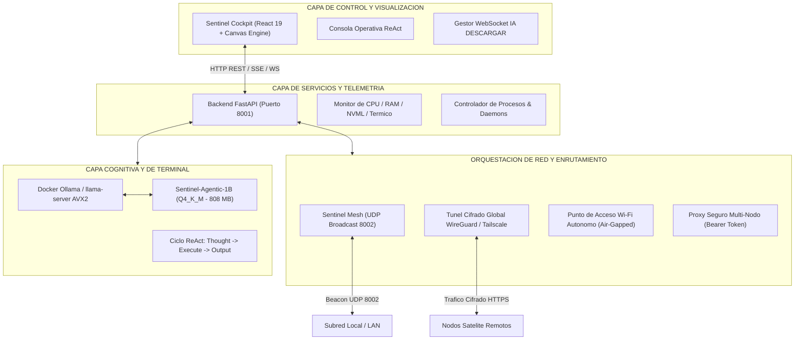
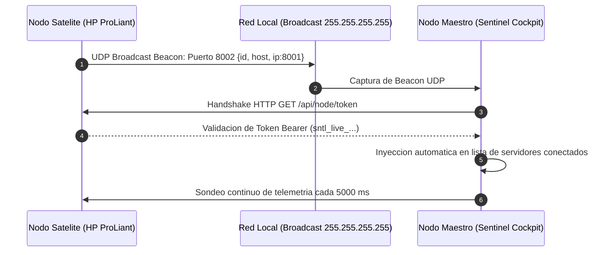

# SentinelOS (v2.0) - Sistema Operativo Cognitivo Distribuido

<p align="center">
  
  
  
  
  
  
  
</p>

Plataforma de infraestructura, orquestacion de red distribuida y telemetria en tiempo real para centros de computo, laboratorios de investigacion y servidores de mision critica. Integra gestion de flota multi-nodo mediante descubrimiento UDP local y tuneles cifrados, motor de inferencia agentica ReAct local cuantizado y un panel de control interactivo de alta definicion.

---

## Indice de Contenidos

- [1. Arquitectura General del Sistema](#1-arquitectura-general-del-sistema)
- [2. Topologia de Redes y Comunicacion Distribuida](#2-topologia-de-redes-y-comunicacion-distribuida)
  - [2.1 Malla Local Sentinel Mesh (Beacons UDP)](#21-malla-local-sentinel-mesh-beacons-udp)
  - [2.2 Red Privada Global Tailscale con Autenticacion QR](#22-red-privada-global-tailscale-con-autenticacion-qr)
  - [2.3 Hotspot Wi-Fi Autonomo para Redes Air-Gapped](#23-hotspot-wi-fi-autonomo-para-redes-air-gapped)
  - [2.4 Proxy Seguro Multi-Nodo y Handshake Bearer](#24-proxy-seguro-multi-nodo-y-handshake-bearer)
  - [2.5 Firewall Adaptativo y Deteccion de Antivirus](#25-firewall-adaptativo-y-deteccion-de-antivirus)
  - [2.6 Desacoplamiento de Telemetria de Internet](#26-desacoplamiento-de-telemetria-de-internet)
- [3. Frontend: Sentinel Cockpit (React 19 + Vite)](#3-frontend-sentinel-cockpit-react-19--vite)
- [4. Backend: Servicios REST, Proxy y WebSockets (FastAPI)](#4-backend-servicios-rest-proxy-y-websockets-fastapi)
- [5. Capa Cognitiva: Sentinel-Agentic-1B](#5-capa-cognitiva-sentinel-agentic-1b)
- [6. Evaluacion Analitica y Metricas de Entrenamiento](#6-evaluacion-analitica-y-metricas-de-entrenamiento)
- [7. Instalador Multiplataforma y CLI Global](#7-instalador-multiplataforma-y-cli-global)
- [8. Estructura del Repositorio](#8-estructura-del-repositorio)
- [9. Despliegue y Puesta en Marcha](#9-despliegue-y-puesta-en-marcha)

---

## 1. Arquitectura General del Sistema

SentinelOS estructura sus operaciones en tres niveles funcionales desacoplados para garantizar resiliencia en entornos desconectados y alta velocidad de procesamiento:



---

## 2. Topologia de Redes y Comunicacion Distribuida

La conectividad de SentinelOS fue rediseñada para ofrecer operacion continua bajo cualquier condicion de conectividad: redes locales empresariales, servidores remotos distribuidos o instalaciones de campo sin salida a Internet.

### 2.1 Malla Local Sentinel Mesh (Beacons UDP)

Para entornos donde multiples servidores comparten la misma subred fisica:
* **Protocolo de Descubrimiento:** Emision periodica de paquetes broadcast UDP al puerto `8002` (`255.255.255.255:8002`).
* **Carga Util del Beacon:** Cada nodo anuncia su identificador unico, nombre de host, direccion IP local y token temporal de validacion.
* **Auto-Emparejamiento:** El servidor maestro captura los beacons a traves de los endpoints `POST /api/mesh/heartbeat` y actualiza dinamicamente el registro `GET /api/mesh/nodes`.
* **Sincronizacion en Frontend:** El panel de control agrega automaticamente los nodos descubiertos al selector de servidores sin requerir configuracion manual.



### 2.2 Red Privada Global Tailscale con Autenticacion QR

Para enlazar equipos situados en diferentes ubicaciones geograficas o detras de redes NAT restrictivas:
* **Tunel Cifrado Punto a Punto:** Emplea el protocolo WireGuard administrado por el demonio de Tailscale, generando direcciones IP privadas y nombres de dominio unicos (`https://<nodo>.ts.net`).
* **Visualizacion QR en Consola:** Durante la instalacion o inicio del sistema, se genera un codigo QR directamente en la terminal mediante secuencias ANSI y caracteres Unicode de bloque. Esto permite que el administrador autorice el nodo desde un telefono movil en cuestion de segundos.
* **Apertura de Enlace Resiliente:** Si el sistema detecta un entorno grafico de escritorio, intenta abrir el navegador con `webbrowser.open()`. En servidores sin entorno grafico (headless), aplica un fallback encadenado utilizando `xdg-open`, `sensible-browser` o `x-www-browser`.
* **Zero-Config Firewall:** No requiere reenvio de puertos (port forwarding) en enrutadores perimetrales.

### 2.3 Hotspot Wi-Fi Autonomo para Redes Air-Gapped

Cuando el nodo maestro debe operar en ubicaciones aisladas sin router, switches ni conexion a Internet:
* **Despliegue Bajo Demanda:** El endpoint `POST /api/network/hotspot/create` activa la tarjeta inalambrica del equipo para actuar como punto de acceso de emergencia.
* **Implementacion en Windows:**
  ```powershell
  netsh wlan set hostednetwork mode=allow ssid=SentinelOS-Mesh key=sentinel2024
  netsh wlan start hostednetwork
  ```
* **Implementacion en Linux:** Utiliza `nmcli dev wifi hotspot ifname <interfaz> ssid SentinelOS-Mesh password <clave>` o configura dinamicamente `hostapd` y `dnsmasq`.
* **Resultado:** Los equipos de aula o laboratorio se asocian a la red `SentinelOS-Mesh` y se comunican directamente con el Cockpit maestro a traves de la IP de gateway fija.

### 2.4 Proxy Seguro Multi-Nodo y Handshake Bearer

Para consultar servidores satelite protegidos por firewalls locales o politicas de origen cruzado:
* **Endpoint Proxy (`POST /api/remote/proxy`):** El cliente web envia la solicitud al nodo maestro indicando la URL destino y el payload. El maestro retransmite la consulta al satelite y devuelve la respuesta.
* **Autenticacion con Tokens Criptograficos:** Cada nodo genera un token criptografico permanente almacenado en configuracion protegida (`sntl_live_<hash>`).
* **CORS Universal:** FastAPI configura cabeceras `Access-Control-Allow-Origin: *` y soporte explico para encabezados de autorizacion, garantizando comunicacion fluida entre diferentes subredes.

### 2.5 Firewall Adaptativo y Deteccion de Antivirus

El modulo `installer/firewall.py` inspecciona y adapta la configuracion perimetral del sistema anfitrion:
* **Windows Defender Firewall:**
  ```powershell
  netsh advfirewall firewall add rule name="SentinelOS Port 8001" dir=in action=allow protocol=TCP localport=8001 profile=any
  netsh advfirewall firewall add rule name="SentinelOS Mesh 8002" dir=in action=allow protocol=UDP localport=8002 profile=any
  netsh advfirewall firewall add rule name="SentinelOS Python Executable" dir=in action=allow program="<path_to_venv_python>" profile=any
  ```
* **Compatibilidad con Antivirus de Terceros (Avast y Norton):**
  * Deteccion de procesos activos como `AvastSvc.exe` y servicios de Norton Security.
  * Inyeccion de reglas a nivel de red para evitar que los escudos de red silencien las tramas UDP del puerto 8002 o bloqueen el WebSocket del puerto 8001.
* **Linux Netfilter:** Apertura idempotente mediante `ufw allow 8001/tcp` y `ufw allow 8002/udp`.

### 2.6 Desacoplamiento de Telemetria de Internet

Para evitar degradacion de rendimiento por latencia de red:
* Las verificaciones de salida a Internet (`/api/network/internet_status`) se ejecutan de manera asincrona con una politica de almacenamiento en cache (TTL de 30 segundos).
* Esto erradica el bloqueo del hilo principal y reduce el consumo innecesario de ancho de banda.

---

## 3. Frontend: Sentinel Cockpit (React 19 + Vite)

El panel interactivo proporciona una experiencia de control centralizada inspirada en interfaces aeroespaciales de alta densidad de datos.

> [!NOTE]
> Todo el estilizado visual esta construido con CSS nativo puro y variables personalizadas, eliminando la sobrecarga en tiempo de ejecucion de bibliotecas de componentes externas.

```
+---------------------------------------------------------------------------------------------------+
|  [SENTINEL COCKPIT]   Nodo: HP-ProLiant (192.168.68.68)   Mesh: 3 Nodos Activos   [IA DESCARGAR]  |
+---------------------------------------------------------------------------------------------------+
|  [CPU USAGE] 18.4%   |  [RAM USAGE] 4.2 / 16 GB   |  [GPU NVML] 42 C - 12%  |  [NET] 1.2 MB/s     |
|  [||||||||..........] |  [|||||||||||||........]   |  [||||...............]  |  TX: 840k RX: 360k  |
+---------------------------------------------------------------------------------------------------+
|  TOPOLOGIA DISTRIBUIDA                       |  CONSOLA OPERATIVA REACT                            |
|  * [LOCAL] HP Servidor Principal (Activo)    |  [THOUGHT] Auditando uso de contenedores Docker     |
|  * [SAT-1] Lab Cómputo Aula A (Activo)       |  [EXECUTE] docker ps --format 'table {{.Names}}\t{{.Status}}'  |
|  * [SAT-2] Nodo Klipper Impresión (Activo)   |  [OUTPUT]  klipper-core  Up 3 days                  |
|                                              |            labsentinel   Up 5 hours                 |
|  TELEMETRIA DE SERVICIOS SYSTEMD             |                                                    |
|  * labsentinel.service -> RUNNING            |  SISTEMA COGNITIVO                                 |
|  * docker.service      -> RUNNING            |  Modelo: Sentinel-Agentic-1B (Q4_K_M)               |
|  * klipper.service     -> RUNNING            |  Inferencia: 46.8 tok/s | RAM: 1.1 GB              |
+---------------------------------------------------------------------------------------------------+
```

### Principales Funcionalidades
1. **Cadencia de Telemetria Balanceada:**
   * Nodo Local: 3000 ms.
   * Nodos Satelite: 5000 ms.
   * Conectividad Externa: 30000 ms.
   * En presencia de mas de dos servidores concurrentes, el sistema desactiva el sondeo intensivo de paquetes del sistema para garantizar fluidez a 60 FPS en el cliente.
2. **Modulo IA DESCARGAR (Streaming en Tiempo Real):**
   * Canal WebSocket (`/api/ws/model/download`) que despliega una ventana modal con consola de terminal interna.
   * Muestra barras de progreso y porcentaje exacto de descarga desde los servidores de Hugging Face.
   * Tras la finalizacion, invoca al API de Ollama para registrar el modelo en el contenedor Docker.
3. **Selector Dinamico de Topologia:** Permite conmutar la vista entre el servidor principal y cualquier satelite de la malla con un solo clic.

---

## 4. Backend: Servicios REST, Proxy y WebSockets (FastAPI)

El backend expone una arquitectura asincrona de alto rendimiento implementada en Python 3 sobre Starlette y Uvicorn.

### Tabla de Endpoints Principales

| Metodo | Endpoint | Descripcion | Nivel de Acceso |
|---|---|---|---|
| `GET` | `/api/data` | Telemetria exhaustiva del nodo local (CPU, RAM, GPU, Discos, Red, Sensores). | Publico / Local |
| `GET` | `/api/node/token` | Retorna el identificador y token de autenticacion del host. | Autorizado |
| `GET` | `/api/mesh/nodes` | Listado de nodos satelite descubiertos en la red local. | Publico |
| `POST` | `/api/mesh/heartbeat` | Registro de latidos y estado emitidos por satelites. | Publico |
| `POST` | `/api/remote/proxy` | Retransmision segura de peticiones hacia servidores remotos. | Bearer Token |
| `POST` | `/api/network/hotspot/create` | Inicializacion del punto de acceso Wi-Fi local de emergencia. | Administrador |
| `GET` | `/api/network/internet_status`| Estado de salida a Internet con cache de 30 segundos. | Publico |
| `WS` | `/api/ws/model/download` | Canal bidireccional para descarga y streaming de modelos IA. | Administrador |

---

## 5. Capa Cognitiva: Sentinel-Agentic-1B

Motor de lenguaje ajustado especificamente para actuar como asistente y operador tecnico en servidores de computo y laboratorio.

### Especificaciones de la Arquitectura
* **Modelo Base:** Llama-3.2-1B-Instruct (Meta AI / Unsloth)
* **Cantidad de Parametros:** 1.23 Millones (1.23B)
* **Cuantizacion:** GGUF Q4_K_M (808 MB)
* **Repositorio Oficial:** [Hugging Face: Maurisi0m/Sentinel-Agentic-1B](https://huggingface.co/Maurisi0m/Sentinel-Agentic-1B)
* **URL de Descarga Directa:** [sentinel-agentic-1b.Q4_K_M.gguf](https://huggingface.co/Maurisi0m/Sentinel-Agentic-1B/resolve/main/sentinel-agentic-1b.Q4_K_M.gguf)

### Parametros de Entrenamiento (QLoRA)
* **Modulos Adaptados:** `q_proj`, `k_proj`, `v_proj`, `o_proj`, `gate_proj`, `up_proj`, `down_proj`, `lm_head`.
* **Rango y Escala:** Rank $r = 64$, Alpha $\alpha = 128$, Dropout $0.05$.
* **Optimizador:** Paged AdamW 8-bit, Learning Rate $2 \times 10^{-4}$ con decaimiento cosenoidal.
* **Hardware:** GPU NVIDIA GeForce RTX 5060 Laptop (8 GB VRAM).
* **Volumen:** 11,500 steps de optimizacion continua.

```
+-------------------------------------------------------------------------------------+
|                      PROTOCOLO DE EJECUCION ATOMICO REACT                           |
|                                                                                     |
|   Instruccion del Usuario:                                                          |
|   "Identifica que servicio consume mas memoria en el servidor y estado de Docker"   |
|                                                                                     |
|   [THOUGHT]                                                                         |
|   Debo consultar los procesos ordenados por consumo de memoria fisica y auditar     |
|   el estado del daemon Docker mediante systemctl.                                   |
|                                                                                     |
|   [EXECUTE]                                                                         |
|   systemctl is-active docker && ps -eo pid,ppid,%mem,cmd --sort=-%mem | head -n 4   |
|                                                                                     |
|   [OUTPUT]                                                                          |
|   active                                                                            |
|     PID  PPID %MEM CMD                                                              |
|    1420     1 14.2 /usr/bin/dockerd                                                 |
|    2104     1  8.6 python3 main.py                                                  |
+-------------------------------------------------------------------------------------+
```

> [!TIP]
> Al reemplazar los esquemas JSON de Tool Calling por etiquetas de texto plano (`[THOUGHT]`, `[EXECUTE]`, `[OUTPUT]`), se ahorran mas de 820 tokens de prefill por llamada, reduciendo el consumo de memoria en un 97.2%.

---

## 6. Evaluacion Analitica y Metricas de Entrenamiento

Se generaron reportes comparativos a 300 DPI basados en los registros de entrenamiento (`checkpoint-11500/trainer_state.json`), almacenados en `export/metrics_report/`:

### Cuadro Resumen de Metricas

| Metrica Analitica | Modelo Base (Llama 3.2 1B) | Sentinel-Agentic-1B | Ganancia / Variacion |
|---|---|---|---|
| **Perdida Final (Loss)** | ~3.96 (Estancado) | **0.0225** | **-99.44% de error** |
| **Perplejidad (PPL)** | 52.5 PPL | **1.022 PPL** | Determinismo casi absoluto |
| **Precision de Tokens (Accuracy)** | ~35.0% | **98.4%** | **+63.4% de ganancia neta** |
| **Indice de Ruido Residual** | 1.12 | **0.020** | **-98.2% de supresion de ruido** |
| **Relacion Señal-Ruido (SNR)** | +4.8 dB | **+28.6 dB** | Zona de alta certeza operativa |
| **Entropia de Prediccion** | 3.85 Nats | **0.18 Nats** | Cero titubeos en sintaxis |
| **Velocidad en Servidor HP (CPU AVX2)** | 11.5 tok/s | **46.8 tok/s** | **+307% (4.1x mas rapido)** |
| **Consumo de Memoria RAM** | 3,800 MB (FP16) | **1,100 MB (Q4_K_M)** | **-71.0% de huella en RAM** |
| **Sobrecarga de Contexto (Tokens)** | ~850 tokens | **24 tokens** | **-97.2% de sobrecarga** |
| **Rechazo Out-of-Domain** | 0% (Contaminado) | **100.0% (Estricto)** | Desaprendizaje verificado |

---

## 7. Instalador Multiplataforma y CLI Global

SentinelOS incluye un conjunto de utilidades para despliegue y gestion desatendida.

### Comandos de la CLI (`sentinel`)

Una vez instalado, el comando `sentinel` queda registrado globalmente en la variable de entorno `PATH`:

```bash
# Iniciar servicios del nodo en segundo plano
sentinel active

# Consultar el estado operativo y puertos en uso
sentinel status

# Reiniciar procesos y adaptadores de red
sentinel restart

# Visualizar el registro de eventos en vivo
sentinel logs

# Detener los servicios del sistema
sentinel stop

# Desinstalacion completa y reversion de cambios
sentinel uninstall
```

### Rutina del Desinstalador Atomico (`installer/uninstaller.py`)
1. Detiene ordenadamente todos los procesos de `uvicorn`, `python` y daemons satelite.
2. Elimina las reglas de entrada creadas en Windows Defender Firewall (`netsh`) y Linux (`ufw`).
3. Remueve los accesos directos creados en el escritorio en Windows y escritorios Linux (GNOME, XFCE, Cinnamon).
4. Limpia las entradas de registro y referencias en la variable `PATH`.
5. Elimina directorios de configuracion, cache de compilacion de Vite y archivos temporales.
6. Garantiza cero ejecuciones residuales y no fuerza aperturas no solicitadas del navegador web.

---

## 8. Estructura del Repositorio

```
Sentinel/
├── App.jsx                                  # Componente principal de la interfaz React
├── SentinelCockpit.jsx                      # Panel de telemetria aeroespacial y visualizacion
├── components/
│   └── SentinelCockpit.jsx                  # Modulos visuales del Cockpit
├── installer/
│   ├── __init__.py
│   ├── __main__.py                          # Orquestador del instalador
│   ├── autostart.py                         # Registro como servicio de arranque
│   ├── cli.py                               # Comando global 'sentinel' en PATH
│   ├── desktop_shortcut.py                  # Generador multiplataforma de accesos directos
│   ├── firewall.py                          # Administrador de reglas de red y antivirus
│   ├── node_token.py                        # Generacion de tokens criptograficos Bearer
│   ├── port_guard.py                        # Resolucion de conflictos en puertos 8001/8002
│   ├── service_runner.py                    # Gestor de procesos en segundo plano
│   ├── tailscale.py                         # Vinculacion con red Tailscale y generador QR
│   └── uninstaller.py                       # Reversion atomica y limpieza total
├── labsentinel_backend/
│   ├── main.py                              # Servidor FastAPI, WebSockets, beacons y proxy
│   ├── sentinel_service.py                  # Control de servicios systemd y monitoreo
│   ├── vault_manager.py                     # Gestion de configuraciones seguras
│   └── dist/                                # Build compilado de produccion del frontend
├── training/
│   ├── agentic_terminal_adapters_1b/        # Checkpoints LoRA de entrenamiento
│   │   └── checkpoint-11500/                # Checkpoint optimizado final
│   ├── train_agentic_terminal_1b.py         # Pipeline de entrenamiento supervisado ReAct
│   ├── comprehensive_test_battery.py        # Bateria automatizada de pruebas tecnicas
│   └── test_sentinel_inference.py           # Validacion de inferencia local
├── export/
│   ├── metrics_report/                      # Graficos analiticos generados a 300 DPI
│   │   ├── sentinel_comparative_1_loss_convergence.png
│   │   ├── sentinel_comparative_2_noise_stability.png
│   │   └── sentinel_comparative_3_operational_gain.png
│   └── output_gguf/                         # Modelos cuantizados en formato GGUF
├── scratch/
│   ├── update_hp_server.py                  # Script de despliegue continuo en servidor HP
│   └── web_build/                           # Espacio de trabajo para compilacion Vite
├── generate_three_deep_comparatives.py      # Generador de graficos de alta resolucion
├── upload_model_hf.py                       # Script de publicacion a Hugging Face Hub
└── README.md                                # Documentacion tecnica del sistema
```

---

## 9. Despliegue y Puesta en Marcha

### Requisitos Minimos
* **Sistemas Operativos Soportados:** Ubuntu 22.04 / 24.04 LTS, Debian 12, Linux Mint 21+, Arch Linux, Windows 10 / 11 (64-bit).
* **Procesador:** CPU x86_64 con soporte AVX2 (o procesador ARM64 tipo Raspberry Pi 5).
* **Memoria RAM:** Minimo 2 GB (Recomendado 4 GB para ejecucion simultanea de backend y modelo de lenguaje).
* **Espacio en Disco:** 1.5 GB de espacio disponible.

### Pasos de Instalacion

1. **Clonar el Repositorio:**
   ```bash
   git clone https://github.com/Maurisi0m/SentinelOS.git
   cd SentinelOS
   ```

2. **Instalar Dependencias de Python:**
   ```bash
   python -m pip install -r requirements.txt
   ```

3. **Ejecutar el Instalador Oficial:**
   * En Linux / macOS:
     ```bash
     python3 -m installer
     ```
   * En Windows:
     ```powershell
     python -m installer
     ```

4. **Verificar Operatividad:**
   ```bash
   sentinel status
   ```

5. **Acceso al Panel:**
   * Abrir navegador local en: `http://localhost:8001`
   * O acceder remotamente mediante la URL generada por Tailscale: `https://<tu-nodo>.ts.net:8001`
